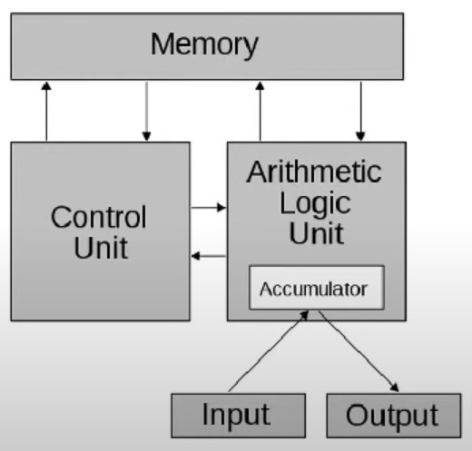

# COA: Computer Organisation and Architecture

## Prerequisites
 - Number system
 - DLDA: Digital Logic, Design and Analysis.

## Architecture VS Organisation
 ### Architecture
  - Architecture means Conceptual design & fundamental operational structure of a computer system.
    - What type of components (i.e CPU, RAM, ROM etc.) will be having in a system? 
    - Specifying functionality of each mentioned components.
    - Specifying CPU design i.e Block diagram of CPU, Pin diagram of cpu and working of CPU and most importantly Instructions that a cpu can take, Addressing Modes & Data format.
 ### Organisation
  (Organisation refers to implementation of computer Architecture)
  - Deals with physical devices and their interconnections.
    - I/O organisation
    - Memory organisation
  - With a perpective of the improving the performance.

 <table class = "table table-info table-sm table-bordered align-middle">
    <thead>
      <th>Architecture</th>
      <th>Organisation</th>
    </thead>
    <tbody>
      <tr>
        <td>CPU Design</td>
        <td>I/O Organisation</td>
      </tr>
      <tr>
        <td>Instructions</td>
        <td>Memory Organisation</td>
      </tr>
      <tr>
        <td>Addressing Modes</td>
        <td>Performance</td>
      </tr>
      <tr>
        <td>Data Format</td>
        <td></td>
      </tr>
    </tbody>
 </table>
 <hr>

 - #### Data Format
    (Representing the data in Binary)

    How the instruction and the data is going to be stored in the system?
    - We can store instruction and data either in **numbers** or second option is **characters**.
    - Numbers can have either **Fixed Point** OR **Floating Point** representation.
    - For characters we two code formats, 
        1. **ASCII** : Uses 8 bits, 7-bits for character + 1-bit for parity.
        2. **EBCDIC** (Extended Binary Coded Decimal Interchange Code): 8-bits per characters.
  
  ### Von Neumann's Architecture
   - Also known as **Stored Program Architecture**.
   - Also known as **Princeton Architecture**.
   - Suggests storing Instruction and Data both in a memory unit.

      

        #### Bottleneck in Von Neumann Architecture
        - Since components are connected with Single set of Bus, hence CPU can't access Data and Instruction simultaneously.
        - Connecting more bus won't work as Memory can only handle one request at a time.
  ### Havard Architecture
   - Havard Architecture is an advancement to  Von Neumann's Architecture.
   - Havard architecture suggests having two separate memory units for instruction and data respectively, so that CPU can fetch instruction and data simultaneously.
   - Its not practically implemented.

```
Question:
 Which of the following is included in the architecture of computer?
 1. Addressing Modes, Design of CPU
 2. Instruction set, Data Format
 3. Secondary Memory, Operating System

Options:
 a) 1 & 2
 b) 2 & 3
 c) 1 & 3
 d) 1, 2, & 3

Answer:
 a.
```

## Components of Computer
 - ### CPU
   CPU consists of:
   - Control Unit (CU)
   - Arithmetic Logical Unit (ALU)

 - ### Memory
   Two types of memory are there
    - Primary Memory / Main Memory
    - Secondary Memory / Auxillary Memory

 - ### I/O Devices
   - Input Devices
   - Output Devices

 - ### Other Components
   - **System Buses**: Connection lines between two devices within the Computer System, for communication. There will muliple lines as one line transfers only one bit.
     
     Types of System Buses:
     - Address Bus: Address bus is **Uni-Directional**, From CPU to Memory/IO devices.
     - Data Bus: Data bus is purely **Bi-Directional**.
     - Control Bus: In Control bus every individual line is **Uni-Directional**.

       Memory generates, **Wait** and **Ready** signals for CPU.
       - Wait: Wait, working on some other instruction.
       - Ready: Ready to take new instruction.
       
       **Memory Cycle Time**: Time from accepting a request till memory gets ready again to perform next operation is known as Memory Cycle Time.

   - **CPU Registers**: Small memory(storage) unit within the CPU.

     Types of CPU Registers:
     - General Purpose Registers (GPRs)
     - Special Purpose Registers:
      1. **Accumulator** (AC): Used to store result of ALU and sometime to store one of the input of the ALU. 
      2. **Program Counter** (PC): Stores address of next instruction. 
      3. **Instruction Register** (IR): Used to store current instruction which CPU is executing.
      4. **Stack Pointer** (SP): Used to store address of the top element of the stack.
      5. **Flag Register**  / **Program Status Word** (PSW): It stores the status of ALU result. Status is stored to check the conditions.
      
          Conditions can be as follows:
          - Whether result is positive or negative.
          - Result is Zeot or not, etc.
          > In Some CPU's Status register is considered as PSW while in others, combination of Accumulator and Status register is considered as PSW. 
      6. **Address Register** (AR) / **Memory Address Register** (MAR): It is used to send address to memory.
      7. **Data Register** (DR) / **Memory Data Register** (MDR) / **Memory Buffer Register** (MBR): It is used to send data to memory (*memory write*) & to recieve data from memory (*memory read*).

     Pseudo Memory Read and Write operation:

     Mem. Read - 
     1) CPU sends address to a memory using address bus.
     2) CPU enables read control signal for memory.
     3) Memory performs read operation & sends the data to CPU using data bus.

     Mem. write -
      1) CPU Sends address to memory using address bus.
      2) CPU sends data to memory using data bus.
      3) CPU Sends enabled write signal to memory.
      4) Memory performs write operation on provided address.

     Types of Architecture: Based on Input to ALU: 
      1. **Accumulator based**: One input of ALU comes from Accumulator, 2nd input can come from all other choices.
      2. **Register based Architecture**: Both the inputs of ALU taken from GPRs, result will be stored to Accumulator.
      3. **Register to Memory Architecture**: One operand(input) of ALU from Register and 2nd from Memory, result in Accumulator.
      4. **Complex-System architecture**: Both inputs can either come from Register or Memory(4 Combination possible), result will get stored in Accumulator.
      5. **Stack based architecture**: Both input comes from Stack based memory.

         > 32-bit and 64-bit in a system specifies the size of a single instruction.
```
Question:
 A CPU has 24-bits instruction. A program starts at address 300 (in decimal). Which of the following is a legal program counter value?

Options:
 a) 400
 b) 500
 c) 600
 d) 700
 
Answer:
 c.
```

## Micro-Operations
- Smallest operation that CPU can execute in one step is known as Micro-Operation.
- In other terms, The operations executed on values stored in registers.
- Mico-Operations have symbolic notation to describe the opertaion known as **Register Transfer Language (RTL)**.

Sample Micro-Operation
- Copy content of Program Counter into Address Register.

  `AR <- PC`; In RTL

### RTL
1. Register Transfer: R1 <- R2 OR R2 -> R1
2. Comma: R1 <- R2 + R3, PC <- PC + 1

   If two or more micro-operation are seperated by comma then all that operation can be executed in Parallel.
3. Memory Transfer: 
   Memory Transfer includes, Memory-Read and Memory-Write.

   Memory-Read: R*i* <- M[Memory Address], here address can come from any register or directly memory location can be specified.

   Memory-Write: M[Memory Address] <- R*i*

### Types of Micro-Operations
1. Arithmetic Micro-Operation:
   - Addition `R1 <= R2 + R3`
   - Subtraction `R1 <- R2 - R3`
   - Complement `R1 <- R2'`
   - 2's Complement `R1 <- R2' + 1`
   - Addition with 2's Complement `R1 <- R2 + R3' + 1`
   - Increment `R1 <- R1 + 1`
   - Decrement `R1 <- R1 - 1`
2. Logical Micro-Operation:
   - AND `R1 <- R2 ^ R3`
   - OR `R1 <- R2 v R3`
   - X-OR `R1 <- R2 ⊕ R3`
   - X-NOR `R1 <- R2 ⊙ R3`
3. Shift Micro-Operation:
   - Logical Shift
     - Logical **Left** Shift of `1 0 1 1 = 0 1 1 0`
     - Logical **Right** Shift of `1 0 1 1 = 0 1 0 1`
   - Circular Shift (Rotation)
     - Circular **Left** Shift of `1 0 1 1 = 0 1 1 1`
     - Circular **Right** Shift of `1 0 1 1 = 1 1 0 1`
   - Arithmetic Shift: **Applied on Signed Numbers** only, hence after arithmetic shift sign of the number should remain same.
     - Arithmetic **Left** Shift, it is similar to logical left shift but sign of number should not be getting changed else operation will be rejected and an error will raised **'ARITHMETIC LEFT SHIFT OVERFLOW'**. `1 1 0 1 = 1 0 1 0`,  `1 0 1 1 = Not Allowed`
     - Arithmetic **Right** Shift of `1 0 1 1 = 1 1 0 1`


```
Question:
 Consider the following program segment. Here R1 and R2 are the general purpose register. Assume that the content of memory location 2000 is 23. All numbers are in decimal. After the excution of this program the value of memory location 2000 is?

 Instructions         Operations

  MOV R1, #5          R1 <- #5
  MOV R2, (2000)      R2 <- M[2000]
  SUB R2, R1          R2 <- R2 - R1
  MOV (2000), R2      M[2000] <- R2
  HALT                Stop

Answer:
 18
```

```
Gate 2007
Info:
 Consider the following program segment. Here R1, R2 and R3 are the general purpose register.

 Instructions         Operations            Instruction Size (in words)

 MOV R1, (3000)      R1 <- M[3000]          2
 LOOP: MOV R2, (R3)  R2 <- M[R3]            1
 ADD R2, R1          R2 <- R2 + R1          1
 MOV (R3), R2        M[R3] <- R2            1
 INC R3              R3 <- R3 + 1           1
 DEC R1              R1 <- R1 - 1           1
 BNZ LOOP            Branch on not Zero     2 
 HALT                Stop                   1

 Assume that the content of memory location 3000 is 10 and the content of the register R3 is 2000. The content of each of the memory locations from 2000 to 2010 is 100. The program is loaded from the memory location 1000. All the numbers are in decimal.

Questions:
 1. Assume that the memory is word addressable. The number of memory references for accessing the data in executing the program completely is: 
 a) 10
 b) 20
 c) 11
 d) 21

 2. Assume that the memory is word addressable. After the execution of this program the content of memory location 2010 is?
 a) 100
 b) 101
 c) 102
 d) 110

 3. Assume that the memory is byte addressable and teh word size is 32-bits. If the interrupt occurs during the execution of the instruction "INC R3", what return address is pushed onto the stack:
 a) 1005
 b) 1024
 c) 1020
 d) 1024

Answers:
1) d.
2) a.
3) c.

```

```
Info:
  In a simplified computer the instructions are:
  OP Ri, Rj  - Performs Rj Op Ri and stores the result in Ri
  OP m, Ri   - Performs val Op Ri and stores the result in Ri
              val denotes the content of memory location m
  MOV m, Ri   - Moves the content of memory location m to register Ri
  MOV Ri, m   - Moves the content of register Ri to memory location m

  The computer has only two registers and OP is either ADD or SUB. Consider the following basic block:

  t1 = a + b
  t2 = c + d
  t3 = e - t2
  t4 = t1 - t3

Question:
  Assume that all operands are initially in memory. The final value of  the computation should be in memory. What is the minimum number of MOV instructions in the code generated for this basic block?

Answer:
  3

Explaination:
  R1 <- a
  R2 <- b
  R1 = R1 + R2, t1
  M[X] <- R1, 1st MOV
  R1 <- c
  R2 <- d
  R1 = R1 + R2, t2
  R2 <- e
  R1 = R2 - R1, t3
  R2 <- M[X], 2nd MOV
  R1 = R2 - R1
  M[X] <- R1, 3rd MOV, Since final result should be in memory.
```
