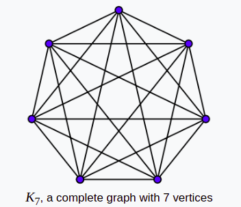

# Graph Theory

## Course Content
 1. Basic definitions
 2. Minimum Spanning trees
 3. Matching
 4. Vertex COver & edge Cover
 5. Connectivity
 6. Network flows
 7. Planar Graphs & Colouring  

## Basic Definitions
 - ### What is Graph?
   Graph is a triplet consisiting vertex set V(G), an edge set E(G), and the relation that associates with each edge and two vertices (**not necessarily distinct**).

    

- ### Order of Graph
  Number of vertices is the order of given graph.

- ### Size of Graph
  Number of edges is the size of given graph.

- ### Loop
  Edge that connects a vertex to itself is termed as loop. OR, Edge starting and ending on same vertex is termed as loop.

- ### Parallel Edges
  Two or more edges having same end points are termed as Parallel edges.

- ### Types of Graphs with Respect to Loops and Multi Edges

  - #### Multi Graphs
    Graphs having parallel-edges and loops.

  - #### Simple Graph(s)
    Graph having neither loops nor parallel-edge(s).

- ### Degree of Vertex
  - Total number of edges incident(incoming) to any vertex is its degree.
  - In case of adjacency matrix representation, sum of values in row gives degree of vertex.

  > If degree of all the vertices in the graph is equal then graph is termed as **REGULAR GRAPH**.

  > If a complete graph have n-vertices then it must be ***n-1*** regular.

- ### Hand-Shaking Lemma
   In any graph G(V, E) the sum of degree of vertices is twice the number of edges.
   
   

- ### Theorem on degree of Vertices
  1. Number of odd degree vertices are even.
  2. The maximum degree of a graph **G**, denoted by , and the minimum degree of a graph, denoted by , and the relation between min/max degree is given by:


- ### Havel Hakimi theorem
  1. **Degree Sequence** - The degree sequence of an undirected graph is the non-increasing sequence of its vertex degrees.
  2. Havel Hakimi theorem checks whether for given degree-sequence, any **SIMPLE GRAPH** exists or not.
  - Algorithm:
    1. Sort the degree-sequence in non-increasing order.
    2. Delete the first element(say V). Subtract 1 from the next V elements.
    3. Repeat 1 and 2 until one of the stopping conditions is(are) met.
  - Stopping conditions: 
    - All the remaining degree(s) are equal to 0, **Simple graph exists**.
    - Negative number comes as result of subtraction after Step 2, **No simple graph exists**.

- ### Complete Graph
  - Two vertices are said to be adjacent if they are connected through atleast one edge.
  - Now, if in a given **Simple graph** every pair of vertices is adjacent then graph is termed as **COMPLETE GRAPH**.

  > The complete graph with ***n*** vertices is denoted by K*n*.

  > With **n** vertices, total number of edges possible in a Complete Graph is given by **C(n, 2) == n * (n-1) / 2**.

   

- ### Difference between Walk, Trail, Path, Circuit and Cycle
  1. Walk - Alternating sequence of vertex and edges in a graph, *starting and ending on a vertex*, such that repetition of Edge and Vertex both is allowed.
     - If Walk starts and ends in same vertex then that walk is termed as **Closed Walk**.
     - Number of *edges* in a walk are equivalent to the length of the walk.
 
  2. Trail - Traversal of graph such that repetition of **edge(s)** is(are) not allowed.
     - Closed Trail is termed as **Circuit**.
     - Number of *edges* in a trail are equivalent to the length of the walk.

  3. Path - Traversal of graph such that repetition of ***neither vertex(vertices) nor edge(s)*** is(are) allowed.
     - Closed Path is termed as **Cycle**.
     - Number of *edges* in a path are equivalent to the length of the walk.

- ### Connected Graph
  - A graph is said to be connected if there exists atleast one path between every pair of vertices, if not so graph is disconnected graph.
  - If graph is disconnected then its maximal connected subgraph(s) are called as components.

  #### Theorem to find whether any graph is connected or not:
    - If sum of degree's of two non-adjacent vertices is greater or equal to one less than number of vertices in a graph then given graph is connected. 

    , where v and u are non-adjacent vertices and n is total number of vertices in a graph.

    - If graph is connected then its minimum degree  will be greater equal to **(n-1)/2**.

- ### Complement of a Graph
  Complement of a graph G, denoted by G complement has same set of vertices V, but two vertices in G complement are adjacent iff they are non adjacent in G.
  - Complement of a **Disconnected graph** is always **Connected** and ***vice-versa***.

## Types of Graph
  
1. ### Null Graph(N*n*)
   A graph with *n* vertices and zero edges is Null Graph.
2. ### Cyclic Graph(C*n*, n>=3)  
   The cycle graph is a simple graph with 'n' vertices {V1, V2, ..., Vn} and edges {V1, V2}, {V2, V3}, ..., {Vn, V1}.
    ```
    A Cyclic graph will always be Regular.
    A Cyclic graph with Even number of Vertices will always be Bipartite.
    ```
3. ### Eulerian Trail
   Eulerian trail is a closed trail which includes all the edges of graph G.
   - A connected graph G is Eulerian iff every vertex i th graph has even degree.

4. ### Hamiltonian Graph
   A Hamiltonian cycle in a graph G is a cycle that includes all the vertices of the Graph.

   A Graph is Hamiltonian if it contnues a Hamiltonian cycle.

5. ### Bipartite Graph
   A Graph G = (V, E) is bipartite if the Vertex set can be partitioned into sets V1 and V2 such that every edge  connects a vertex of V1 to a vertex of V2.
   - Degree of Bipartite graph == **max(m, n)**, where **m** and **n** are number of vertices in V1 and V2.
   - Degree sum of V1 will always be equal to degress sum of V2.
   - Maximum edges possible = .
   - Complete Bipartite Graph(K*m*, n) = A Bipartite graph in which every vertex in V1 is adjacent to every vertex in V2 set, i.e m == n.
   - A Graph is bipartite iff it does not have any odd cycles.